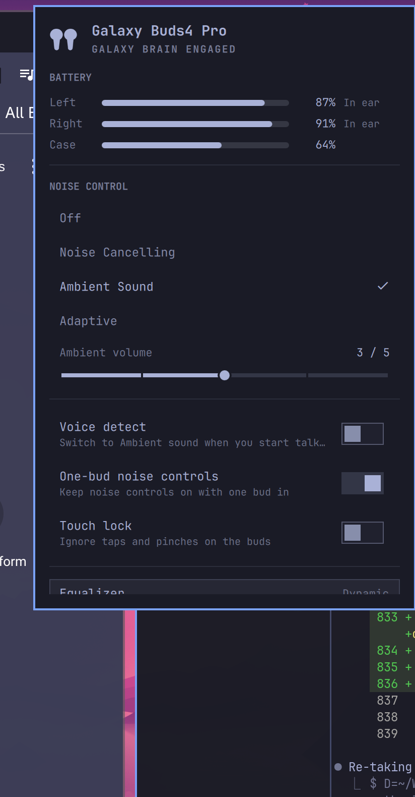

<h1 align="center">Galaxy Buds for Omarchy</h1>

<p align="center">
  Battery for each bud and the case, noise controls, ambient volume, voice detect,
  touch lock, equalizer and find-my-buds, drawn in Omarchy's own panel idiom.
</p>

<p align="center">
  
</p>

<p align="center">
  
  <br><sub>The bar mark is an outline of the Buds4 Pro, drawn in the theme's foreground like every other glyph.</sub>
</p>

## What it shows

- **Battery** for the left bud, the right bud and the case, each with a charging
  and in-ear hint. BlueZ only ever reports one number for the pair; the
  per-bud and case levels come from Samsung's own control channel.
- **Noise control**: Off, ANC, Ambient and, on the models that have it,
  Adaptive, as a row of chips. Only the modes the daemon says the device has
  are drawn, and the current one also sits in the pill next to the name.
- **Ambient volume**, shown while Ambient Sound is the active mode.
- **Voice detect** (Samsung's "detect conversations"), **one-bud noise
  controls** and **touch lock**, each gated on what the model supports.
- **Equalizer** presets as chips, and **Find my buds**, the bell next to the
  name, which rings them and refuses to while they are in your ears.
- The bar icon dims while nothing is connected and takes the theme's urgent
  colour once a bud drops to 20% off the charger.

## Screenshots

| | |
|:---:|:---:|
|  | **Galaxy Buds4 Pro, both buds in ear**<br>Adaptive selected and voice detect on, with the noise-control and equalizer chips and the three toggles; the bell next to the name rings the buds. Picking Ambient adds the ambient-volume slider under the chips. |

The panel is built from the capability keys the daemon publishes, so a model
without voice detect gets no Voice detect row, and a model that never reports
Adaptive never draws it. Screenshots of other models are welcome in a pull
request.

## Known limitations

- **Changing the noise mode on the buds does not update the panel live, on the
  Buds4 Pro.** Panel → buds works and is acknowledged; buds → panel does not.
  When you pinch-and-hold to cycle the mode, this firmware sends no
  notification over the control link — no `NOISE_CONTROLS_UPDATE`, no fresh
  extended status, and no gesture frame either; the only unsolicited traffic is
  the head-tracking sensor stream. There is also no request that reads the
  current mode back, so the panel cannot poll for it, and the one thing that
  would force a fresh status — dropping and reopening the link — takes the audio
  profile down with it, which is not a trade worth making for a status refresh.
  The panel corrects itself on the next reconnect. GalaxyBudsClient marks the
  Buds4 Pro extended status as "not properly implemented" for the same reason.
  If your model *does* push updates on a pinch (several older ones do), they are
  handled and the panel keeps up. Reports with a `--debug` frame log from a
  model that pushes are welcome.

## Volume OSD

A swipe on the buds moves the PipeWire sink volume directly, but the stock shell
only raises its volume OSD when it changes the volume itself, so nothing pops on
a swipe. The optional `omarchy-buds-osd` companion closes that gap: it watches
the default sink and shows the same OSD, with the same icons the volume keys
use, whenever the volume changes from outside the shell — the buds included.

`setup` installs and enables it. It is a small shell script, separate from the
plugin and the buds daemon, and genuinely general: any external volume change
raises the OSD, not only the buds. To install without it, or to turn it off:

```bash
OMARCHY_BUDS_OSD=0 ~/.config/omarchy/plugins/io.github.hmarquez-solutions.buds/setup
# or, later:
systemctl --user disable --now omarchy-buds-osd.service
```

## Deliberately absent

- **Volume and output device** live in the stock Audio panel, which already
  switches PipeWire sinks. Press `Tab` in this panel to walk to it.
- **Connect, disconnect and forget** live in the stock Bluetooth panel.
- **Firmware updates, fit test, 360 audio, Bixby**: the protocol carries them,
  the bar does not need them.

## Supported models

The panel is built from the capability keys the daemon publishes, so different
buds get different panels. Payload layouts follow
[GalaxyBudsClient](https://github.com/timschneeb/GalaxyBudsClient)'s decoders.

| Model | Tested | Notes |
|---|:---:|---|
| Galaxy Buds4 Pro | ✅ | developed against this pair |
| Galaxy Buds4, Buds3, Buds3 Pro, Buds3 FE | | same payload family as the Buds4 Pro |
| Galaxy Buds2 Pro, Buds2, Buds FE, Buds Core | | separate layouts, untested |
| Galaxy Buds Pro | | generic SPP UUID, no charging state |
| Galaxy Buds Live, Buds+ | | battery only |
| Galaxy Buds (2019) | ✗ | different frame header, not supported |

If you have one of the untested models, `omarchy-buds daemon --debug` logs every
frame; an issue with that output and what the Wearable app shows is enough to
fix an offset.

## Requirements

- Omarchy 4.x (Quickshell bar).
- Galaxy Buds paired the usual way. The daemon needs the SPP link, so keep the
  buds' Bluetooth connection to the machine; it does nothing while they are
  connected to your phone instead.
- `python-gobject`, which Omarchy installs by default. Nothing else: the daemon
  is a single Python file that talks to BlueZ over D-Bus.

## How it works

```
Galaxy Buds ──RFCOMM (Samsung SPP UUID)──▶ BlueZ ──Profile1 fd──▶ omarchy-buds daemon
                                                                       │
                                            ~/.local/state/omarchy-buds/status.json
                                                                       │ (file watch)
                                                          Panel.qml in omarchy-shell
```

The daemon registers a client `org.bluez.Profile1` for Samsung's private SPP
UUID with `AutoConnect`, so BlueZ hands it a socket whenever the buds connect,
including after a reboot or a reconnect from the case. It introduces itself the
way the Wearable app does and the buds answer with a full status, then keep
pushing changes: battery, in-ear state, a noise mode switched by pinching a bud.

Every change is written atomically to `status.json`; the file is removed when the
daemon stops. The panel watches that file and nothing else, so an idle desktop
runs no processes on its behalf. `omarchy-buds <verb>` is used only when you
change something, over a Unix socket in `$XDG_RUNTIME_DIR/omarchy-buds`.

The plugin never touches Bluetooth itself. If the daemon is not running, the
panel says so in one line instead of drawing an empty surface.

## Install

```bash
omarchy plugin add https://github.com/hmarquez-solutions/omarchy-buds --enable
~/.config/omarchy/plugins/io.github.hmarquez-solutions.buds/setup
```

`--enable` places the widget on the right of the bar. `setup` copies the daemon
to `~/.local/bin/omarchy-buds`, installs `omarchy-buds.service` and starts it.
It preflights every fixed target, refuses symlinks/directories and unrelated
existing files, and records hashes of installed files so later updates can be
rolled back if service activation fails. Files from an install that predates
the manifest are recognised by content. An unattended update that would replace
a file it cannot prove is its own must be run with `OMARCHY_BUDS_FORCE=1`.
The icon stays hidden until Galaxy Buds are connected. To keep it visible:

```bash
omarchy bar set io.github.hmarquez-solutions.buds hideWhenDisconnected false --json
```

Update with `omarchy plugin update io.github.hmarquez-solutions.buds` and run
`setup` again so the installed daemon matches.

## What this installs

`setup` is the only extra step after `omarchy plugin add`. It puts:

- the daemon at `~/.local/bin/omarchy-buds`, and a user unit
  `omarchy-buds.service` (enabled and started) that runs it under
  `/usr/bin/python3 -I`
- the volume-OSD watcher at `~/.local/bin/omarchy-buds-osd` and
  `omarchy-buds-osd.service` (enabled unless you set `OMARCHY_BUDS_OSD=0`)
- `python-gobject`, via `omarchy pkg add`, only if it is missing — Omarchy
  already ships it

Nothing else. No system-wide units, and no extra packages on a stock Omarchy
install.

## Remove

```bash
~/.config/omarchy/plugins/io.github.hmarquez-solutions.buds/uninstall
omarchy plugin remove io.github.hmarquez-solutions.buds
```

`uninstall` stops and disables both services, removes only files it can prove
are its own, and deletes the state directory. The same by hand:

```bash
systemctl --user disable --now omarchy-buds.service omarchy-buds-osd.service
rm -f ~/.local/bin/omarchy-buds ~/.local/bin/omarchy-buds-osd
rm -f ~/.config/systemd/user/omarchy-buds.service ~/.config/systemd/user/omarchy-buds-osd.service
rm -rf ~/.local/state/omarchy-buds
systemctl --user daemon-reload
omarchy plugin remove io.github.hmarquez-solutions.buds
```

## Security

The marketplace review asked for specific properties. Each one, and where it
lives:

| Property | How | Where |
|----------|-----|-------|
| Only BlueZ can hand the daemon a socket | `Profile1` calls are accepted only from `org.bluez`'s unique bus name, resolved with `GetNameOwner` and re-pinned on `NameOwnerChanged`; the well-known name is never trusted. | `daemon/omarchy-buds` (`on_profile_call`) |
| A fixed interpreter, no environment influence | The shebang, the unit's `ExecStart` and the panel all run `/usr/bin/python3 -I`. Isolated mode ignores `PYTHONPATH`, `PYTHONHOME` and the user site directory and keeps the script directory off `sys.path`. The panel clears the shell's environment and passes only `HOME`, `XDG_RUNTIME_DIR`, `XDG_STATE_HOME`, a fixed `PATH` and `LANG`. | `daemon/omarchy-buds:1`, `daemon/omarchy-buds.service`, `Service.qml` |
| Helpers bound to trusted paths | `setup`, `uninstall` and the OSD watcher export `PATH=/usr/bin:/bin` and call `/usr/bin/pactl`, `/usr/bin/omarchy-osd` and `/usr/bin/omarchy` by absolute path. Both units start with that fixed `PATH`. | `setup`, `uninstall`, `daemon/omarchy-buds-osd`, both `.service` files |
| IPC fails closed | The control socket, its directory and the status file are checked for type, owner and mode `0700`/`0600` before use, on both ends. Commands over 4 KiB, replies over 64 KiB, status over 64 KiB and more than 16 clients are refused. The panel reports "daemon not running" rather than showing stale state. | `daemon/omarchy-buds` (`MAX_*`, `runtime_dir`, `status_path`), `Service.qml` |
| Nothing the daemon writes is readable by others | `UMask=0077`, `StateDirectoryMode=0700`, `RuntimeDirectoryMode=0700`. | `daemon/omarchy-buds.service` |
| No hidden verbs | The CLI exposes exactly the verbs listed under Command line. There is no raw-frame passthrough. | `daemon/omarchy-buds` (`cli`) |
| Sandboxed services | `ProtectSystem=strict`, `ProtectHome=read-only`, `NoNewPrivileges`, empty `CapabilityBoundingSet`, `RestrictNamespaces`, `LockPersonality`, `SystemCallArchitectures=native`, the `ProtectKernel*` set, and `RestrictAddressFamilies=AF_UNIX AF_BLUETOOTH` (the OSD watcher: `AF_UNIX` only). | both `.service` files |
| Install never overwrites what it cannot prove is its own | Every target is preflighted; symlinks, directories and unrelated files are refused. Installed files are hashed into a manifest, staged, then published, and a failed service activation rolls back to the previous files. | `setup` |
| Removal takes only what setup installed | Files are removed only when their hash matches the manifest or the current source; anything else is reported and left in place. | `uninstall` |
| No network, no sudo, no user config edits | Nothing in the tree opens a network socket, escalates, or writes outside its own state and runtime directories. The one package it may add is `python-gobject`, through `omarchy pkg add`, and only if `gi` is missing. | whole tree |

## Keyboard

| Key | Action |
|-----|--------|
| `j` / `k`, `↓` / `↑` | move between rows |
| `h` / `l`, `←` / `→` | walk the chips on the noise-control and equalizer rows, or adjust the ambient volume |
| `enter` / `space` | activate the current row, or apply the chip under the cursor |
| `o` | Off |
| `n` | Noise Cancelling |
| `a` | Ambient Sound |
| `d` | Adaptive, on the models that have it |
| `c` | toggle voice detect |
| `b` | toggle one-bud noise controls |
| `l` | toggle touch lock |
| `e` | cycle the equalizer preset |
| `f` | ring the buds / stop ringing |
| `r` | refresh |
| `tab` | move to the next panel |
| `esc` | close |

Left click opens the panel. Right click cycles the noise mode without opening
anything. Middle click toggles touch lock.

## Command line

The same verbs the panel uses, handy for keybindings:

```bash
omarchy-buds status
omarchy-buds noise anc|ambient|off|adaptive|cycle
omarchy-buds ambient-volume 0..4
omarchy-buds conversation on|off
omarchy-buds onebud on|off
omarchy-buds touch-lock on|off
omarchy-buds eq off|bass|soft|dynamic|clear|treble|cycle
omarchy-buds find start|stop|toggle
```

The panel itself answers `omarchy-shell buds open|close|toggle|noise|status`.

## Settings

| Setting | Default | Notes |
|---------|---------|-------|
| Hide when disconnected | on | Leaves the bar entirely rather than sitting there with nothing to say. |

The panel always runs `/usr/bin/python3 -I ~/.local/bin/omarchy-buds`; there
is deliberately no setting that points it elsewhere.

## Icon

The bar and hero draw the pair as a hairline outline with `QtQuick.Shapes`, so
it takes the bar foreground like a font glyph and follows every theme. The path
in `BudsOutline.js` is traced from Samsung's product cut-out; regenerate it
with:

```bash
magick assets/buds4-pro-black-cutout.png -alpha extract -compress none pgm:- \
  | python3 tools/trace-icon.py > BudsOutline.js
```

## Tests

`Model.js` holds the parsing and formatting with no QML imports, so it runs
outside the shell. The daemon's framing, CRC and payload decoders have their own
suite with synthetic frames, including the one documented sample from
GalaxyBudsClient.

```bash
node tests/model.test.js
python3 -m unittest discover -s tests
```

## Credits

The SPP protocol was reverse-engineered by Tim Schneeberger in
[GalaxyBudsClient](https://github.com/timschneeb/GalaxyBudsClient). This daemon
is a separate implementation of that protocol. Firmware updates, the fit test
and the debug pages live in GalaxyBudsClient, not here.

The bar panel is modelled on [omarchy-pods](https://github.com/thisisgm/omarchy-pods)
by GM.

Galaxy Buds is a trademark of Samsung Electronics, which does not sponsor or
endorse this plugin.

## Licence

MIT, see [LICENSE](LICENSE).
